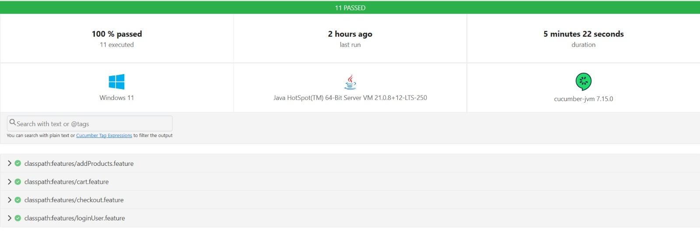

# Automatización Front – SauceDemo (Playwright + Cucumber + Java)

Suite de pruebas E2E para [https://www.saucedemo.com/](https://www.saucedemo.com/) usando **Playwright (Java)**, **Cucumber (Gherkin)** y el patrón **Page Object Model (POM)**.

## Requisitos

* **Java 17+** (probado con JDK 21)
* **Maven 3.8+**


## ▶️ Ejecución

### Toda la suite

```powershell
mvn test
```
### Por tags

```powershell
mvn --% -Dcucumber.filter.tags="@smoke" test
mvn --% -Dcucumber.filter.tags="@negativo" test
mvn --% -Dcucumber.filter.tags="@login" test
mvn --% -Dcucumber.filter.tags="@addProducts" test
mvn --% -Dcucumber.filter.tags="@cart" test
mvn --% -Dcucumber.filter.tags="@Checkout" test
```

Tags escenarios postivos(@smoke) y negativos(@negativo)
```bash
mvn -Dcucumber.filter.tags="@smoke" test
mvn -Dcucumber.filter.tags="@negativo" test
```

### Ver la ejecución en navegador (“headful”)

```bash
mvn --% -Dheadless=false -DslowMo=200 -Dchannel=chrome test
```



---

## Reportes

* **Cucumber HTML:** `target/cucumber-report.html`
* **Cucumber JSON:** `target/cucumber.json`
* **Screenshots:** se adjuntan automáticamente en el HTML (manejados por `Hooks.java`)


## Tags usados

* Por feature: `@login`, `@addProducts`, `@cart`, `@Checkout`
* **Smoke:** `@smoke` (escenarios felices)
* **Negativos:** `@negativo` (validaciones y errores esperados)


## Credenciales de prueba

* **Usuario estándar:** `standard_user / secret_sauce`
* **Usuario bloqueado:** `locked_out_user / secret_sauce`
